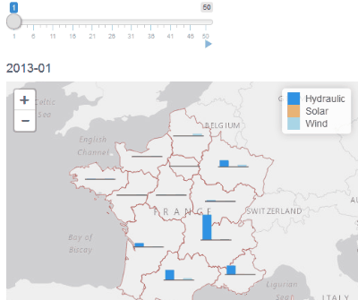

For a few years now, it has become very to create interactive maps with R thanks to the package `leaflet` by the Rstudio team. Nevertheless, it only provides only a few functions to create basic shapes on a map, so the information that can be represented on a single map is limited: if you have some data associated to some points, you can only represent at most two variables by drawing circles and changing their radius and color according to data.

`leaflet.minicharts` is an R package that provides two functions to add and update small charts on an interactive maps created with the package `leaflet`. These charts can be used to represent as many variables as desired associated to geographical points. Currently, three types of chart are supported: barcharts (the default), pie charts and polar area charts.

let's have a look to a concrete example.

## Data

The package provides a table that contains the electric production, consumption and exchanges of France from january 2010 to february 2017 and of 12 french regions from january 2013 to february 2017. 

In addition to the total production, the table contains one column for each type of production. The table also contains the lattitude and longitude of the center of the regions.

```{r}
library(leaflet.minicharts)
data("eco2mix")
head(eco2mix)
```

The package also provides the contours of french regions.

```{r}
data("regions")
class(regions)
```

## Renewable productions in 2016

Nowadays, France has an objective of 23% of renewable energies in the consumption of the country by 2020. Are the country close to its objective. Is the share of renewable energies similar in all regions? 

To answer this question let us focus on the year 2016 We first prepare the required data with package `dplyr`:

```{r message=FALSE}
library(dplyr)

prod2016 <- eco2mix %>%
  mutate(
    renewable = bioenergy + solar + wind + hydraulic,
    non_renewable = total - bioenergy - solar - wind - hydraulic
  ) %>%
  filter(grepl("2016", month) & area != "France") %>%
  select(-month) %>%
  group_by(area, lat, lng) %>%
  summarise_all(sum) %>%
  ungroup()

head(prod2016)
```

We also create a base map that will be used in all the following examples

```{r message=FALSE}
library(leaflet)

tilesURL <- "http://server.arcgisonline.com/ArcGIS/rest/services/Canvas/World_Light_Gray_Base/MapServer/tile/{z}/{y}/{x}"

basemap <- leaflet(width = "100%", height = "400px") %>%
  addTiles(tilesURL) %>%
  addPolylines(data = regions, color = "brown", weight = 1, fillOpacity = 0)

basemap
```

We now add to the base map a pie chart for each region that represents the share of renewable energies. We also change the width of the pie charts so their area is proportional to the total production of the corresponding region. Finally we use `addLegend` a function of leaflet package to create a legend.

```{r}
colors <- c("#4fc13c", "#cccccc")

basemap %>%
  addMinicharts(
    prod2016$lng, prod2016$lat,
    type = "pie",
    data = prod2016[, c("renewable", "non_renewable")], 
    colorPalette = colors, 
    width = 60 * sqrt(prod2016$total) / sqrt(max(prod2016$total))
  ) %>% 
  addLegend(
    "topright",
    colors = colors, opacity = 1,
    labels = c("Renewable", "Non renewable")
  )
```

We can see that the three south east regions exceed the target of 23%, but most regions are far from this objective. Globally, renewable energies represented only 19% percent of the production of 2016. 

Now let's represent the different types of renewable production using bar charts.

```{r}
renewable2016 <- prod2016 %>% select(hydraulic, solar, wind)
colors <- c("#3093e5", "#fcba50", "#a0d9e8")
basemap %>%
  addMinicharts(
    prod2016$lng, prod2016$lat,
    data = renewable2016,
    colorPalette = colors,
    width = 45, height = 45
  ) %>% 
  addLegend(
    "topright",
    colors = colors, opacity = 1,
    labels = c("Hydraulic", "Solar", "Wind")
  )
```

Hydraulic production is far more important than solar and wind. Without surprise, solar production is more important in south while wind production is more important in the north.

## Representing a single variable

`leaflet.minicharts` has been designed to represent multiple variables at once, but you still may want to use it to represent a single variable. In the next example, we represent the total load of each french region in 2016. When data passed to `addMinicharts` contains a single column, it automatically represents it with circle which area is proportional to the corresponding value. In the example we also use the parameter `showLabels` to display rounded values of the variable inside the circles. 

```{r}
basemap %>%
  addMinicharts(
    prod2016$lng, prod2016$lat,
    data = prod2016$load,
    showLabels = TRUE,
    width = 45
  )
```

This is nice, isn't it?

## Updating existing mini charts

The second function of the package, `updateMinicharts` can be used inside a shiny application to update the data or the appearance of existing minicharts on a map. 

To illustrate this, let create a simple application to visualize the evolution of the different renewable productions. First we prepare the data for our application by splitting it by month. But before splitting the data, we compute the maximal value of the columns we will represent. Indeed, the function `addMinichart` will only have a small proportion of the data and so it won't be able to correctly set the maximal value data can take. This will create invalid scales and truncated charts.

```{r}
appdata <- eco2mix %>% filter(area != "France")
maxValue <- max(appdata[, c("hydraulic", "solar", "wind")])
appdata <- split(appdata, appdata$month)
```

`appdata` is a list with one data.frame for each month in the data. We can now create our shiny application. The important thing to note is the usage of parameter `layerId`. This parameter is mandatory if one wants to use `updateMinicharts` and it must contain only unique values.

```{r eval=FALSE}
ui <- fluidPage(
  sliderInput("monthId", "", 1, length(appdata), value = 1, step = 1, animate = TRUE),
  tags$h4(textOutput("month")),
  leafletOutput("map")
)

server <- function(input, output, session) {
  # Display month
  output$month <- renderText(names(appdata)[input$monthId])
  
  # Initialize the map
  output$map <- renderLeaflet({
    data <- appdata[[1]]
    
    basemap %>% 
      addMinicharts(
        data$lng, data$lat, 
        data = data[, c("hydraulic", "solar", "wind")],
        maxValues = maxValue,
        colorPalette = colors,
        width = 45, height = 45,
        layerId = data$area
      ) %>% 
      addLegend(
        "topright",
        colors = colors, opacity = 1,
        labels = c("Hydraulic", "Solar", "Wind")
      )
  })
  
  # Update minicharts when the slider value changes
  observeEvent(input$monthId ,{
    data <- appdata[[input$monthId]]
    
    leafletProxy("map", session) %>% 
      updateMinicharts(
        layerId = data$area,
        data = data[, c("hydraulic", "solar", "wind")]
      )
  })
  
}

shinyApp(ui, server)
```

Here is a gif of the result:


